#Fusion Tables for Beginners

CAR Conference 2014 
Baltimore, Md. 
Daniel Lathrop 
2014-02-28 

Handout and data at: http://github.com/lathropd/talks

##A what?
Fusion Tables are Google's answer to a relational database in the cloud. It's like an online version of Microsoft Access (or MySQL or Postgres or ...) with minimal features but good visualization tools. And yes, it has SQL inside.

##Part A: Import some data
1. Create one at [google.com/drive/apps.html#fusiontables](http://www.google.com/drive/apps.html#fusiontables)
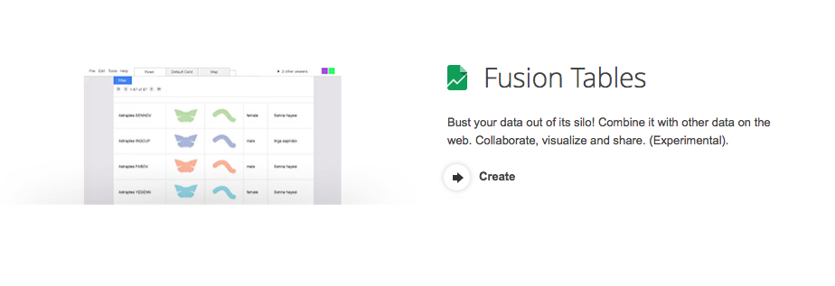
2. Choose method of creating file ("From this computer").
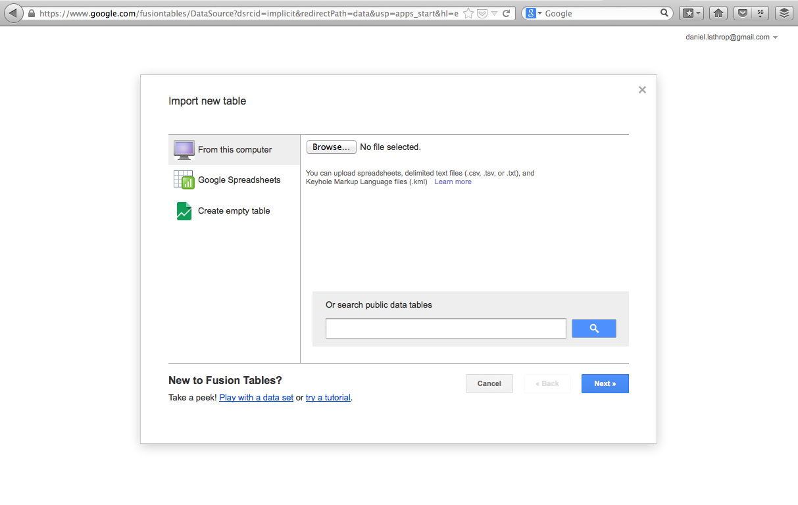
3. Select our sample data (Maryland Census Data from American Communities Survey 2012) from the IRE training folder.
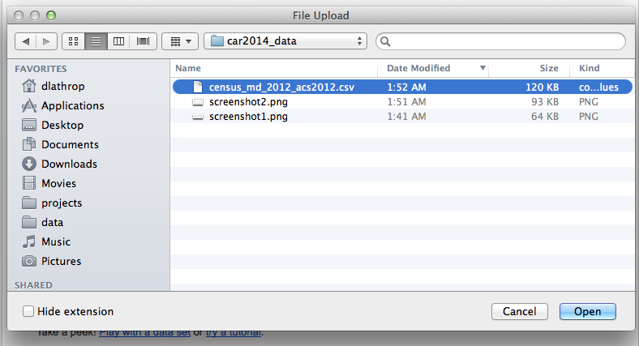
4. Setup the import
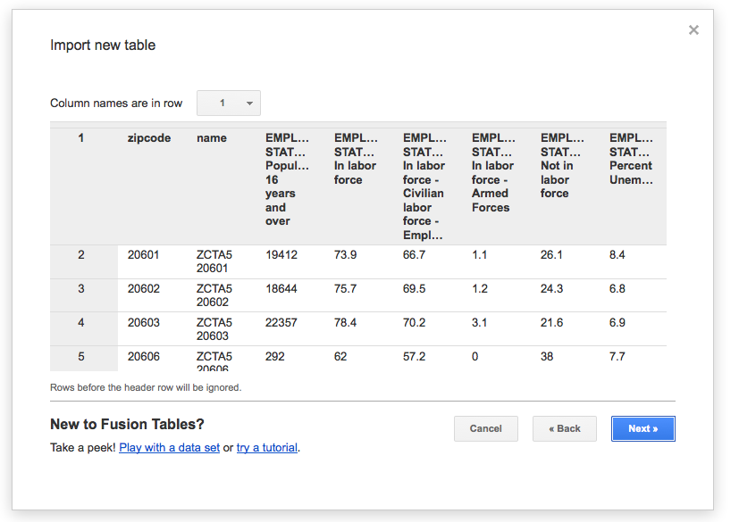
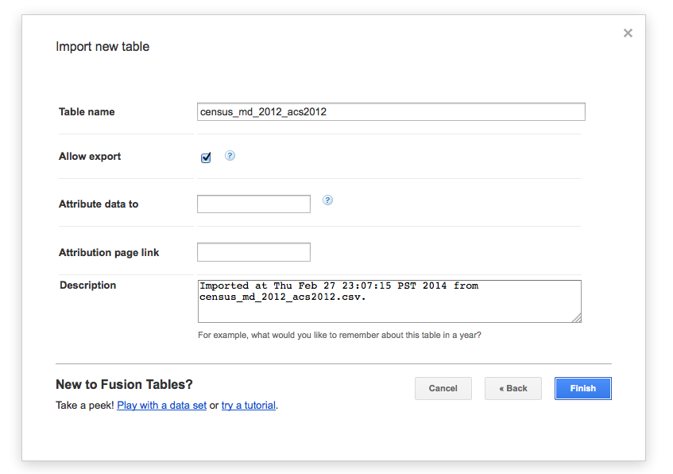
5. Wait ...

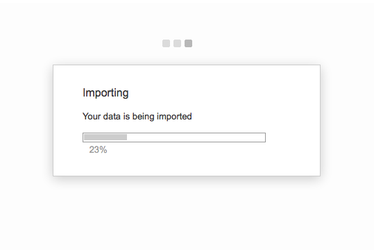

##Part B: Examine it
------------------
1. Look at your data
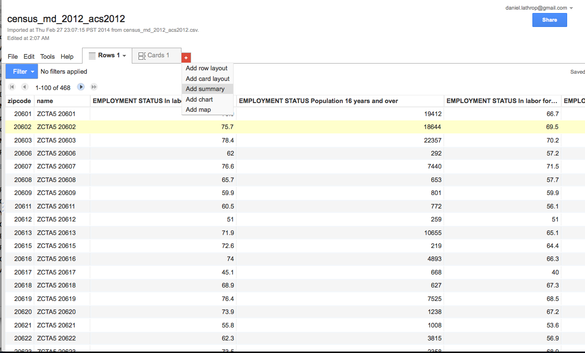
2. Pick some columns to summarize
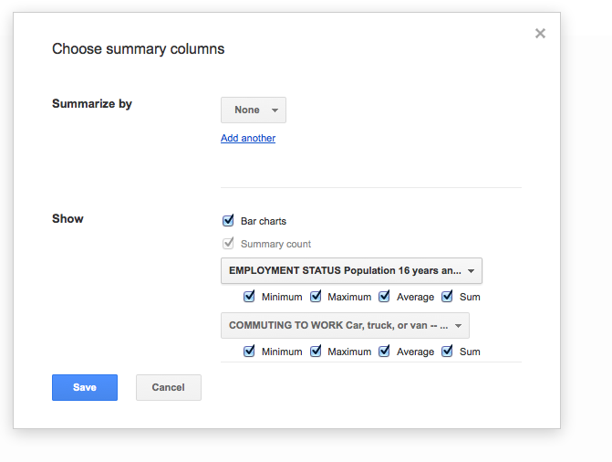
3. OK, that's ugly
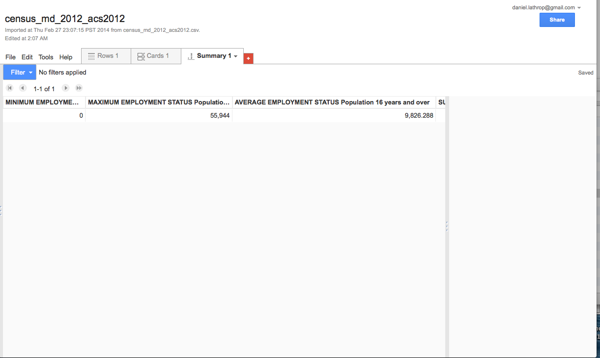
4. Change some column names
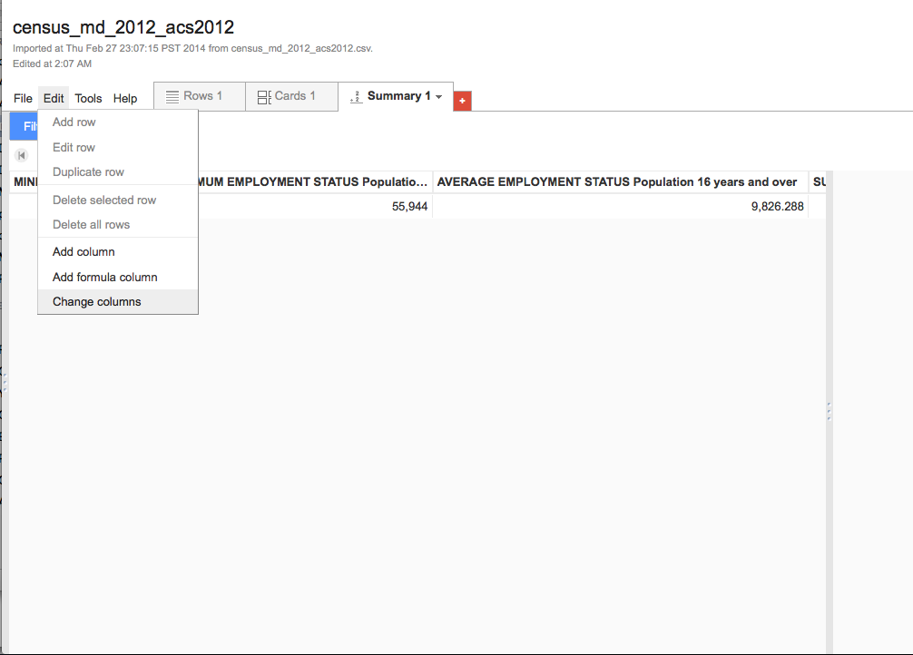

--

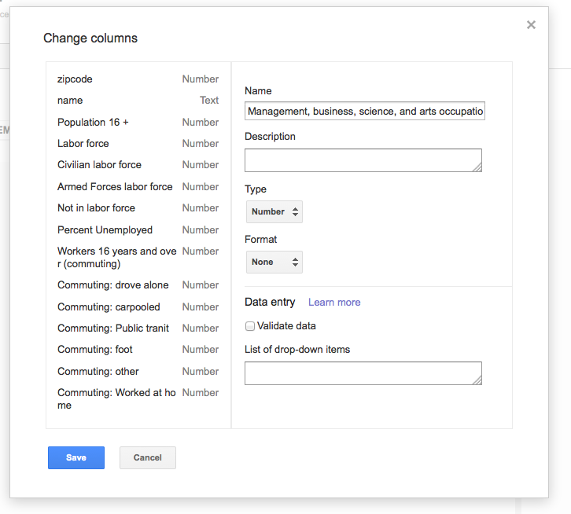 
5. Try to map it
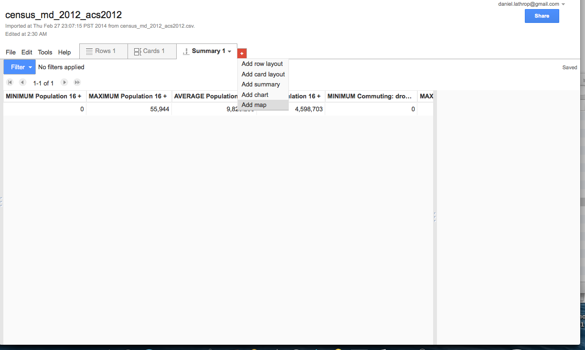

--

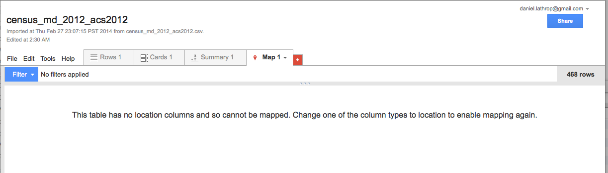 
6. Make zipcodes into a location
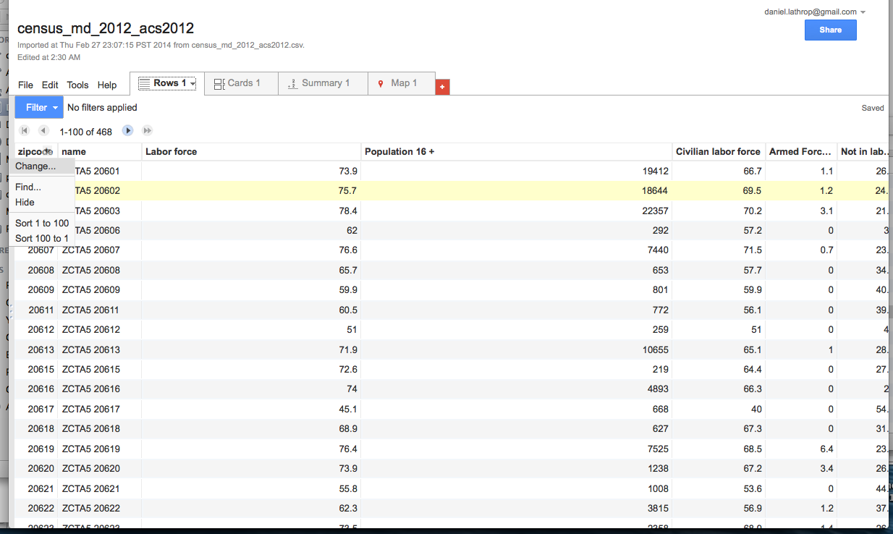

--

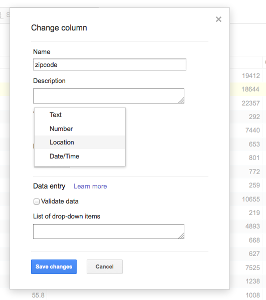 
7. Wait again, then look at your map
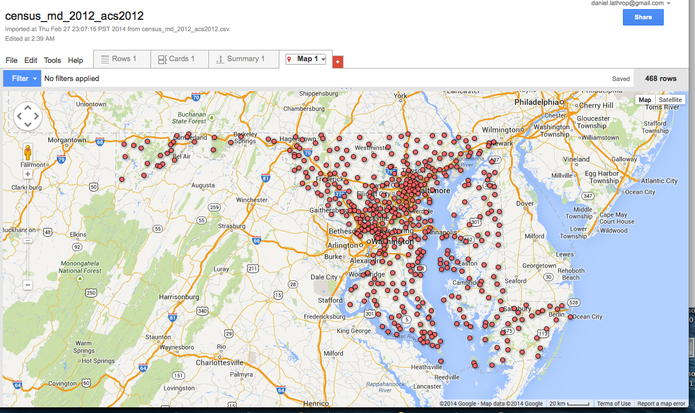 
8. Now edit your map 
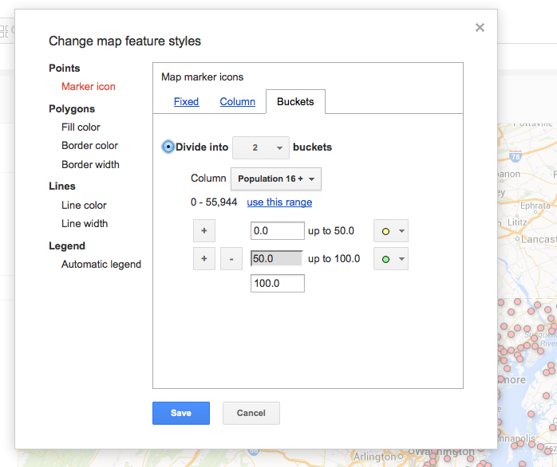

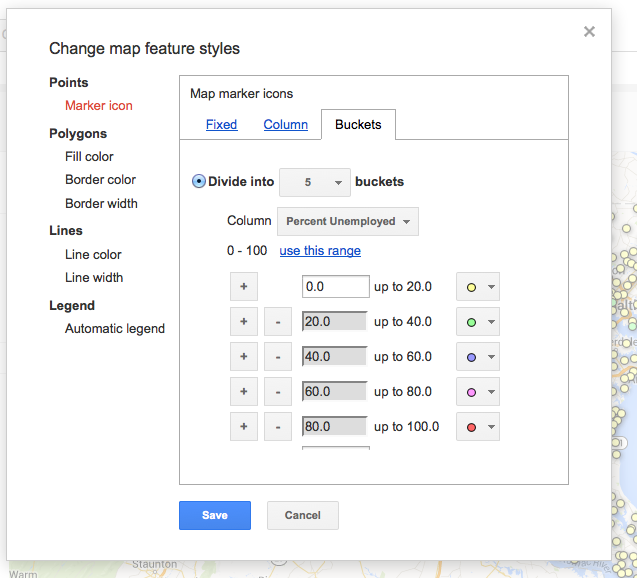 

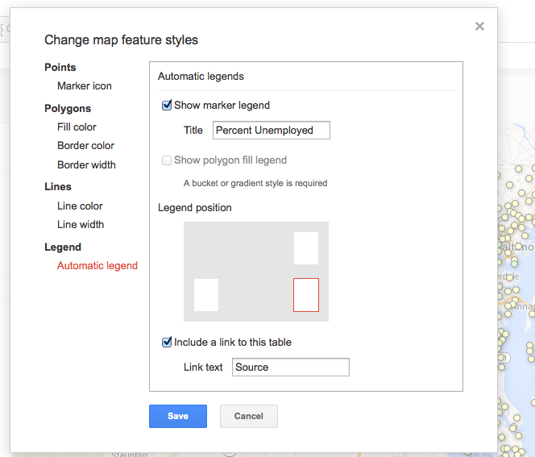 
9. Filter data and admire your work
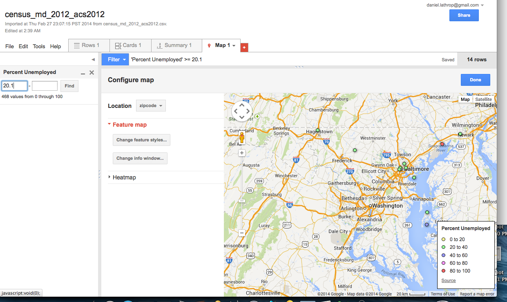

